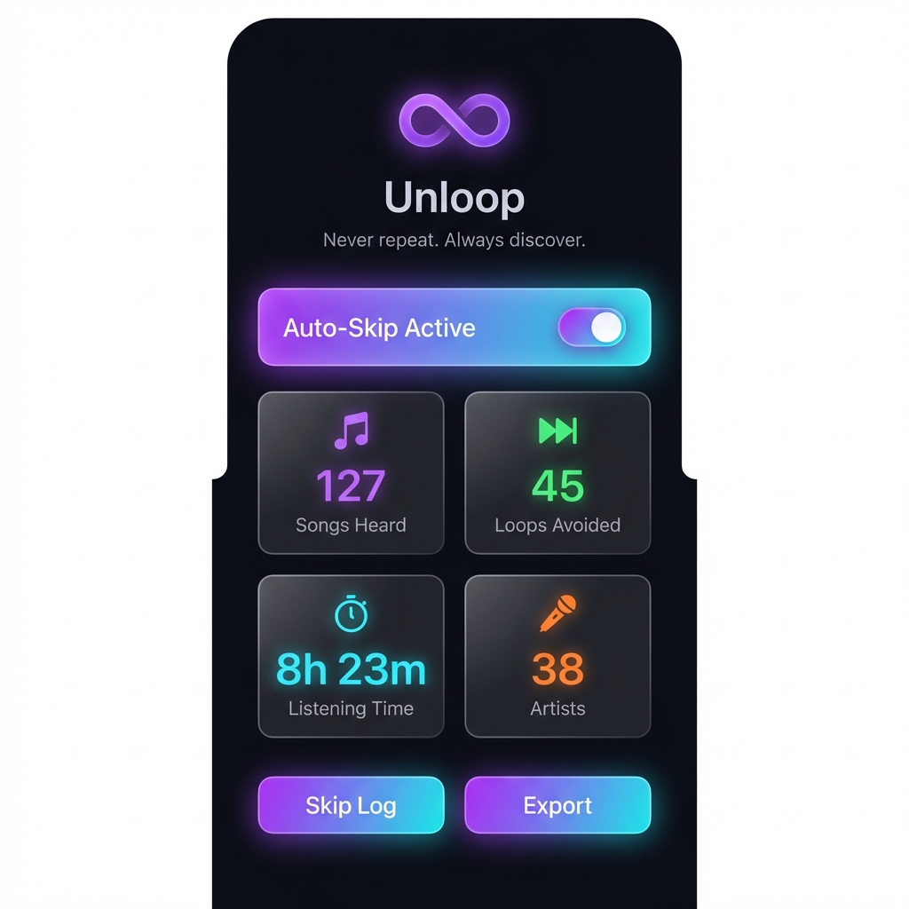

# 🔄 Unloop

**Never repeat. Always discover.**

Unloop automatically skips songs you've already heard, ensuring you always discover new music on Spotify and YouTube.

<p align="center">
  
</p>

---

## ✨ Features

- **🎯 Auto-Skip** - Automatically skips previously heard songs
- **📊 Listening Stats** - Track songs, artists, loops avoided, and listening time
- **🔔 Skip Log** - View history of all skipped songs
- **🌙 Dark Theme** - Beautiful glassmorphism UI
- **🔒 Privacy First** - All data stays on your device

## 📱 Screenshots

| Main Screen | Stats |
|-------------|-------|
|  | Track your listening habits |

## 🚀 Installation

### Requirements
- Android 8.0+ (API 26)
- Spotify or YouTube Music app

### Build from Source
```bash
# Clone the repository
git clone https://github.com/yourusername/unloop.git

# Open in Android Studio
# OR build via command line:
cd android-app
./gradlew assembleDebug
```

### Setup Permissions
After installing, grant these permissions:

1. **Accessibility Service** - Enables auto-skip functionality
2. **Notification Access** - Detects currently playing songs

## 🎯 How It Works

1. **Detect** - Monitors notifications from music apps
2. **Check** - Compares against your listening history database
3. **Skip** - Automatically skips songs you've heard before

## 🔒 Privacy

- ✅ All data stored locally in SQLite
- ✅ No network requests or analytics
- ✅ Minimal permissions required
- ✅ Open source code

## 🛠️ Tech Stack

| Technology | Purpose |
|------------|---------|
| Kotlin | Primary language |
| Room | Local database |
| Material 3 | UI components |
| Coroutines | Async operations |

## 📂 Project Structure

```
app/src/main/java/com/unloop/app/
├── MainActivity.kt              # Main UI
├── data/
│   ├── Song.kt                  # Data models
│   ├── SongDao.kt               # Database queries
│   └── UnloopDatabase.kt        # Room database
└── service/
    ├── MusicNotificationListenerService.kt  # Song detection
    └── UnloopAccessibilityService.kt        # Auto-skip logic
```

## 📝 License

MIT License

---

<p align="center">Made with ❤️ for music lovers who crave variety</p>
